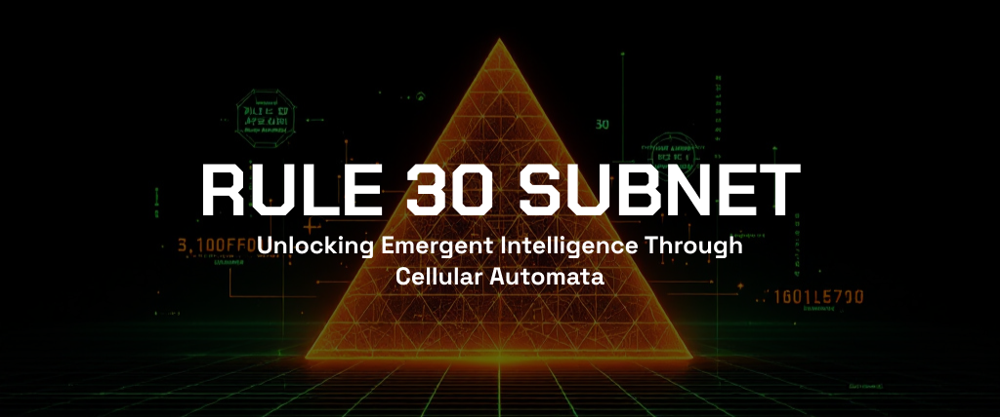

<div align="center">

# Rule 30: Unlocking Emergent Intelligence Through Cellular Automata <!-- omit in toc -->


[](https://opensource.org/licenses/MIT)

---
###### At the intersection of mathematics and machine intelligence lies a profound mystery: How do simple rules give rise to complex behavior? Through distributed computation, we aim to unlock the secrets of emergence itself.
</div>

- [Introduction](#introduction)
- [The Rule 30 Challenge](#the-rule-30-challenge)
- [Overview of Miner and Validator Functionality](#overview-of-miner-and-validator-functionality)
  - [Miner](#miner)
  - [Validator](#validator)
- [License](#license)


## Introduction

The Rule 30 subnet on Bittensor aims to tackle one of complexity science's most fundamental challenges: understanding how simple rules give rise to complex, seemingly random behavior. Through distributed computation and collective analysis, we're working to unlock the secrets of emergence itself—the mysterious process by which simple systems generate intricate, unpredictable patterns.

While major research institutions have explored these phenomena using traditional computing approaches, the computational demands of analyzing long-term pattern behavior have limited progress. The Rule 30 subnet represents a paradigm shift: harnessing the collective power of distributed computing to generate and analyze cellular automata patterns at an unprecedented scale.

Through this subnet, we aim to generate and analyze the first 1 trillion values of Rule 30's center column, potentially unlocking new approaches to cryptography, pattern recognition, and artificial intelligence.


## The Rule 30 Challenge

Cellular automata are mathematical models that demonstrate how complex behavior can emerge from simple rules. Rule 30, introduced by Stephen Wolfram, is particularly fascinating—despite following elementary rules, it generates patterns that appear random and unpredictable, challenging our understanding of complexity and computation.

Wolfram posed three fundamental questions about Rule 30 that remain unanswered:
1. **Pattern Periodicity**: Does the center column always remain non-periodic?
2. **Distribution Properties**: Does each color of cell occur on average equally often in the center column?
3. **Computational Complexity**: Does computing the nth cell of the center column require at least O(n) computational effort?

[](https://rule30prize.org)

These questions strike at the heart of complexity science and have profound implications for multiple fields:
- **Cryptography**: Understanding pattern generation for secure systems
- **Machine Learning**: Training models on emergent behavior
- **Complex Systems**: Predicting outcomes in chaotic systems

Recent research has demonstrated that transformer [models trained on cellular automata data exhibit enhanced performance on advanced tasks](http://www.arxiv.org/pdf/2410.02536). By generating a massive dataset of Rule 30 computations, our project enables new approaches to AI model training while working towards answers to Wolfram's fundamental questions.

## Overview of Miner and Validator Functionality

To solve the fundamental questions posed by Wolfram, our subnet coordinates validators and miners to collaboratively generate and analyze the first 1 trillion values of the center column of Rule 30.

### Miner

**Miners:** generate Rule 30 patterns by computing specified row ranges of the cellular automaton. Using optimized algorithms and parallel processing, miners calculate pattern segments that contribute to our goal of analyzing 1 trillion steps of Rule 30's center column.

### Validator

**Validators:** distribute computational tasks and verify results. Since Rule 30 is deterministic, validation is straightforward - each computation has exactly one correct answer. Validators check accuracy, measure response time, and reward miners accordingly.

### Running a miner or validator
To run either a miner or validator, export the following environment variables as needed(all are optional):
```bash
export CHAIN_ENDPOINT=wss://entrypoint-finney.opentensor.ai:443 
export NETUID=36
export EPOCH_LENGTH=100
```

#### Running a miner
Then, to run a miner, export the extra PORT environment variable along with wallet info as needed, and serve the port to chain:
```bash
export PORT=8091
export WALLET_NAME=default
export HOTKEY_NAME=default
export WALLET_PATH=~/.bittensor/wallets

# IP required, port optional(would use PORT otherwise)
cargo run --bin serve-axon 1.2.3.4 8091
```

and then start your miner:
```bash
# Without PM2:
cargo run --bin miner

# With PM2
pm2 start --name rule-30-miner --interpreter none -- cargo run --bin miner
```

#### Running a validator
Then, to run a validator, export the wallet info as needed:
```bash
export WALLET_NAME=default
export HOTKEY_NAME=default
export WALLET_PATH=~/.bittensor/wallets
```

and then start your validator:
```bash
# Without PM2:
cargo run --bin validator

# With PM2
pm2 start --name rule-30-validator --interpreter none -- cargo run --bin validator
```

## License
The Rule 30 Bittensor subnet is released under the [MIT License](./LICENSE).

<div align="center">
  
  <p>Connect with us on social media</p>
  <a href="https://twitter.com/wombo" style="margin-right: 10px;">
    
  </a>
  <a href="https://www.instagram.com/wombo.ai/">
    
  </a>
</div>
